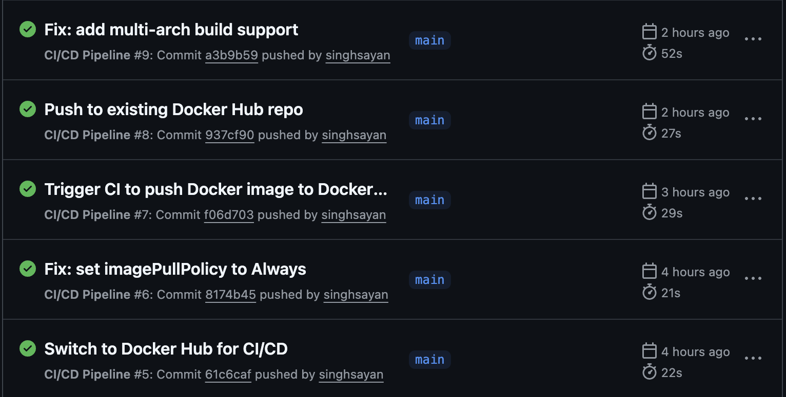
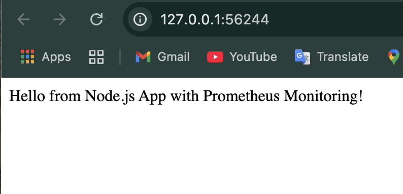
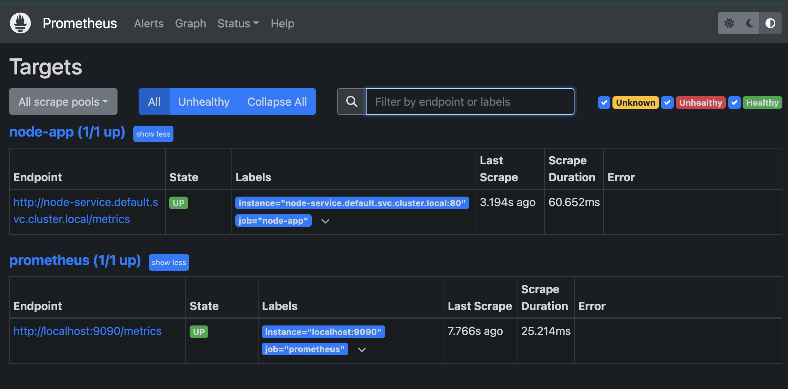
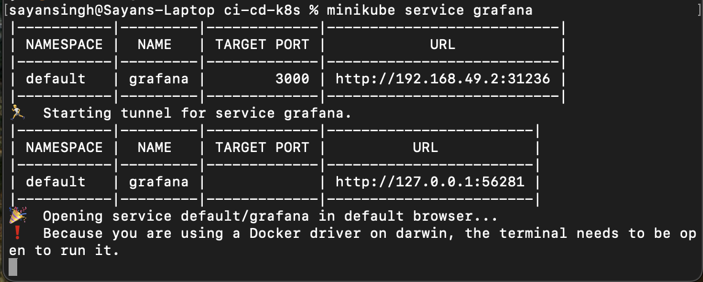

# 🚀 Kubernetes Monitoring Stack with Node.js, Prometheus, Grafana, and GitHub Actions

This project demonstrates a complete monitoring-enabled deployment pipeline for a containerized Node.js application using Kubernetes, Prometheus, and Grafana. CI/CD is fully automated with GitHub Actions, and deployments are tested locally using Minikube.

---

## ✅ Project Highlights

- 🟢 **Node.js Application**: Lightweight backend service written in Node.js, exposing basic endpoints for monitoring.
- 🐳 **Dockerized**: Fully containerized using Docker with a production-ready `Dockerfile`.
- ☸️ **Kubernetes Native**: Application and observability stack deployed via Kubernetes manifests, including Deployments, Services, and Persistent Volumes.
- 📈 **Prometheus Integration**: Configured to scrape metrics from the application with a custom `prometheus.yml`.
- 📊 **Grafana Dashboards**: Set up to visualize key application and cluster metrics with persistent storage.
- 🤖 **CI/CD with GitHub Actions**: Automated pipeline builds and pushes Docker images to Docker Hub on every commit to `main`.
- 🧪 **Minikube Deployment**: Manual deployment workflow using Minikube for local development and testing.

---

## ⚙️ Technologies Used

- **Node.js**, **Express**
- **Docker**, **Docker Hub**
- **Kubernetes**, **Minikube**
- **Prometheus**, **Grafana**
- **GitHub Actions (CI/CD)**
- **YAML**

---

<h3>✅ GitHub Actions Success</h3>
<p>Shows multiple successful workflow runs:</p>

<br/><br/>

<h3>📦 Node.js App Running (Browser Output)</h3>

<br/><br/>

<h3>📈 Prometheus - Targets Page</h3>

<br/><br/>

<h3>📊 Grafana - Custom Dashboard</h3>

<br/><br/>

<h3>🔌 Prometheus Service - Terminal Output</h3>

<br/><br/>

<h3>📊 Grafana Service - Terminal Output</h3>

<br/><br/>


---

## 🧪 Commands Used

Deploy the application and observability stack locally using Minikube:

### 1. Start Minikube

```bash
minikube start

# Create namespaces for Prometheus and Grafana

kubectl create namespace prometheus
kubectl create namespace grafana

# Apply all Kubernetes manifests

kubectl apply -f k8s/
kubectl apply -f k8s/prometheus
kubectl apply -f k8s/grafana

# Expose services via Minikube

minikube service grafana
minikube service prometheus-service -n prometheus
minikube service node-service
