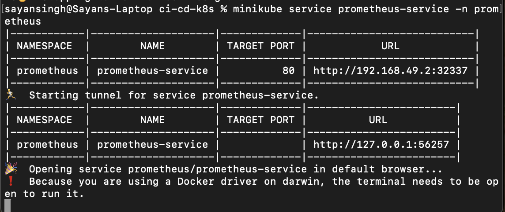

# 🚀 Kubernetes Monitoring Stack with Node.js, Prometheus, Grafana, and GitHub Actions

This project demonstrates a complete monitoring-enabled deployment pipeline for a containerized Node.js application using Kubernetes, Prometheus, and Grafana. CI/CD is fully automated with GitHub Actions, and deployments are tested locally using Minikube.

---

## ✅ Project Highlights

* 🟢 **Node.js Application**: Lightweight backend service written in Node.js, exposing basic endpoints for monitoring.
* 🐳 **Dockerized**: Fully containerized using Docker with a production-ready `Dockerfile`.
* ☘️ **Kubernetes Native**: Application and observability stack deployed via Kubernetes manifests, including Deployments, Services, and Persistent Volumes.
* 📊 **Prometheus Integration**: Configured to scrape metrics from the application with a custom `prometheus.yml`.
* 📈 **Grafana Dashboards**: Set up to visualize key application and cluster metrics with persistent storage.
* 🤖 **CI/CD with GitHub Actions**: Automated pipeline builds and pushes Docker images to Docker Hub on every commit to `main`.
* 🧰 **Minikube Deployment**: Manual deployment workflow using Minikube for local development and testing.

---

## ⚙️ Technologies Used

* **Node.js**, **Express**
* **Docker**, **Docker Hub**
* **Kubernetes**, **Minikube**
* **Prometheus**, **Grafana**
* **GitHub Actions (CI/CD)**
* **YAML**

---

### ✅ GitHub Actions Success

Shows multiple successful workflow runs:


### 📦 Node.js App Running (Browser Output)


### 📈 Prometheus - Targets Page


### 📊 Grafana - Custom Dashboard


### 🔌 Prometheus Service - Terminal Output



### 📊 Grafana Service - Terminal Output


---

## 🔄 GitHub Actions CI/CD Setup

This project uses GitHub Actions to automatically build and push Docker images to Docker Hub when you push code to the `main` branch.

### 🥉 How It Works:

1. **Docker Build & Push**

   * The workflow defined in `.github/workflows/ci-cd.yml` runs on each `main` branch push.
   * It builds the Docker image and pushes it to Docker Hub using secrets for authentication.

2. **Secrets Required**

   * Add the following secrets to your GitHub repository:

     | Secret Name       | Description                       |
     | ----------------- | --------------------------------- |
     | `DOCKER_USERNAME` | Your Docker Hub username          |
     | `DOCKER_PASSWORD` | Your Docker Hub password or token |

3. **Trigger**

   * Push your code to the `main` branch. GitHub Actions will:

     * Checkout code
     * Set up Docker Buildx
     * Login to Docker Hub
     * Build & push image to Docker Hub
     * Tag format: `DOCKER_USERNAME/my-first-docker-image:latest`

4. **CI Only**

   * The workflow automates **CI** — i.e., build and push to Docker Hub.
   * You can then manually pull & deploy using Kubernetes (**CD step**) via Minikube.

---

## 🧪 Commands Used

Deploy the application and observability stack locally using Minikube:

### 1. Start Minikube

```bash
minikube start
```

### 2. Create Namespaces

```bash
kubectl create namespace prometheus
kubectl create namespace grafana
```

### 3. Apply All Kubernetes Manifests

```bash
kubectl apply -f k8s/
kubectl apply -f k8s/prometheus
kubectl apply -f k8s/grafana
```

### 4. Expose Services via Minikube

```bash
minikube service grafana
minikube service prometheus-service -n prometheus
minikube service node-service
```

---

Feel free to ⭐ the repo if you found it helpful or fork it to expand and build upon it!
